# Spark与Spring Boot集成项目

## 项目概述

本项目是一个完整的Spring Boot与Apache Spark集成的应用程序，旨在演示如何在Java Web应用中使用Spark进行大数据分析和实时流处理。通过REST API，用户可以访问多种数据分析功能，包括基础的RDD操作、SparkSQL查询、Spark MLlib机器学习以及Spark Streaming流处理。

## 技术栈

- **Spring Boot**: 2.7.0 用于构建RESTful API和Web应用
- **Apache Spark**: 3.3.0 用于大数据处理
- **Spark MLlib**: 用于机器学习算法实现
- **Spark Streaming**: 用于实时数据流处理
- **Spark GraphX**: 用于图计算和网络分析
- **React.js**: 用于前端界面

## 系统架构

### 整体架构图

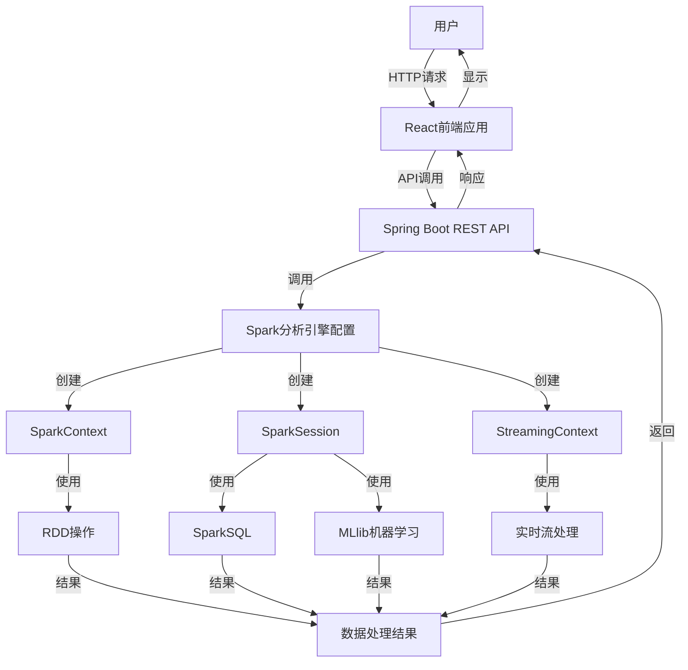

### 系统交互序列图

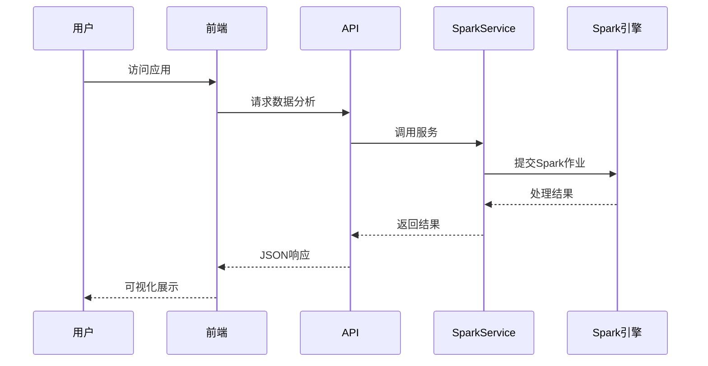

### 数据处理流水线

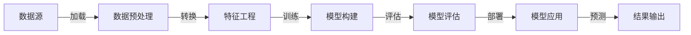

## 详细API接口文档

### 1. 基础Spark操作API

#### 1.1 词频统计 API

**接口路径**: `POST /api/spark/wordcount`

**词频统计流程图**:

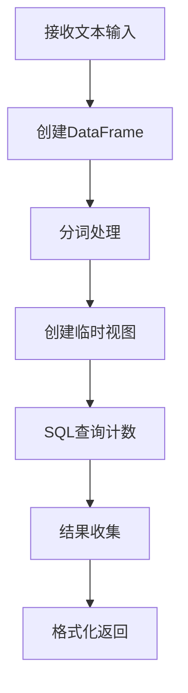

**功能描述**: 接收文本，使用Spark RDD对文本进行分词和词频统计

**请求格式**:
```
Content-Type: text/plain

这是一段示例文本内容，用于展示Spark RDD词频统计功能。
这里包含重复的词，Spark会统计每个词出现的次数。
```

**响应格式**:
```json
{
    "result": {
        "这是": 1,
    "一段": 1,
        "示例": 1,
        "文本": 1,
    "内容": 1,
        "用于": 1,
    "展示": 1,
    "Spark": 2,
    "RDD": 1,
    "词频": 1,
    "统计": 2,
    "功能": 1,
    "这里": 1,
    "包含": 1,
    "重复": 1,
    "的": 1,
    "词": 1,
    "会": 1,
    "每个": 1,
    "词出现": 1,
    "次数": 1
  },
  "totalWords": 22,
  "uniqueWords": 21
}
```

**实现原理**:
- 将输入文本转换为JavaRDD
- 使用flatMap进行分词处理
- 将每个词映射为(word, 1)的键值对
- 使用reduceByKey合并相同的键并计算总和
- 收集结果并转换为Map返回

**核心代码**:
```java
public Map<String, Long> wordCount(String text) {
    // 创建schema
    StructType schema = new StructType(new StructField[]{
        DataTypes.createStructField("line", DataTypes.StringType, true)
    });
    
    // 创建DataFrame
    List<Row> rows = Arrays.asList(text.split("\n")).stream()
        .map(line -> RowFactory.create(line))
        .collect(java.util.stream.Collectors.toList());
        
    Dataset<Row> linesDF = sparkSession.createDataFrame(rows, schema);
    
    // 创建临时视图
    linesDF.createOrReplaceTempView("lines");
    
    // 使用SQL进行单词计数
    Dataset<Row> wordCounts = sparkSession.sql(
        "SELECT word, COUNT(*) as count " +
        "FROM (SELECT explode(split(line, ' ')) as word FROM lines) " +
        "WHERE word != '' " +
        "GROUP BY word"
    );
    
    // 将结果转换为Map
    return wordCounts.select("word", "count")
            .collectAsList()
            .stream()
            .collect(java.util.stream.Collectors.toMap(
                row -> row.getString(0),
                row -> row.getLong(1)
            ));
}
```

**Spark知识点**:
- `JavaRDD`: Spark的基本分布式数据集抽象
- `flatMap`: 将一个元素映射到多个元素的转换操作
- `map`: 一对一的元素转换操作
- `reduceByKey`: 按键聚合操作，合并相同键的值
- `collect`: 将分布式数据集收集到驱动程序内存中

#### 1.2 CSV数据分析 API

**接口路径**: `GET /api/spark/analyze-csv`

**功能描述**: 读取CSV文件，进行数据分析和统计

**响应格式**:
```json
{
    "status": "success",
  "recordCount": 1000,
  "fieldNames": ["id", "name", "age", "city", "income"],
  "summary": {
    "ageStats": {
      "min": 18,
      "max": 65,
      "avg": 32.5
    },
    "incomeStats": {
      "min": 5000,
      "max": 50000,
      "avg": 15000
    }
  }
}
```

**实现原理**:
- 使用SparkSession读取CSV文件
- 使用DataFrame API进行数据分析
- 使用Spark SQL进行数据聚合
- 收集结果并转换为JSON格式返回

**核心代码**:
```java
public Dataset<Row> readCsvFile() throws IOException {
    try {
        // 直接使用相对路径
        String filePath = "src/main/resources/data/sample.csv";
        System.out.println("CSV文件路径: " + filePath);
        
        // 读取CSV文件
        Dataset<Row> df = sparkSession.read()
                .option("header", "true") // 第一行为标题
                .option("inferSchema", "true") // 自动推断数据类型
                .csv(filePath);
        
        // 显示数据结构
        df.printSchema();
        
        // 返回数据集
        return df;
    } catch (Exception e) {
        System.err.println("读取CSV文件失败: " + e.getMessage());
        e.printStackTrace();
        throw new IOException("无法读取CSV文件: " + e.getMessage(), e);
    }
}
```

**Spark知识点**:
- `SparkSession`: Spark 2.0+的入口点
- `DataFrameReader`: 用于读取各种格式数据的接口
- `Dataset<Row>`: 带有Schema的分布式数据集，类似于关系型数据库表
- `inferSchema`: 自动推断数据类型的功能
- `printSchema`: 打印DataFrame结构的调试工具

#### 1.3 城市年龄统计 API

**接口路径**: `GET /api/spark/city-age-stats`

**功能描述**: 按城市分组计算平均年龄

**响应格式**:
```json
{
  "cityStats": [
    {
      "city": "北京",
      "avgAge": 32.5,
      "count": 150
    },
    {
      "city": "上海",
      "avgAge": 30.2,
      "count": 120
    },
    {
      "city": "广州",
      "avgAge": 28.7,
      "count": 90
    }
  ],
    "totalCities": 3
}
```

**实现原理**:
- 加载CSV数据
- 使用DataFrame API按城市分组
- 计算每组的平均年龄
- 按平均年龄排序
- 转换结果并返回

**核心代码**:
```java
public Dataset<Row> aggregateData(Dataset<Row> df) {
    // 按城市分组，计算平均年龄
    Dataset<Row> result = df.groupBy("city")
            .agg(org.apache.spark.sql.functions.avg("age").as("avg_age"))
            .orderBy("avg_age");
    
    // 显示结果
    result.show();
    
    return result;
}
```

**Spark知识点**:
- `groupBy`: DataFrame的分组操作
- `agg`: 聚合函数，如sum, count, avg等
- `orderBy`: 结果排序
- `show`: 显示DataFrame内容

### 2. 高级Spark功能API

#### 2.1 K-means聚类分析 API

**K-means聚类流程图**:

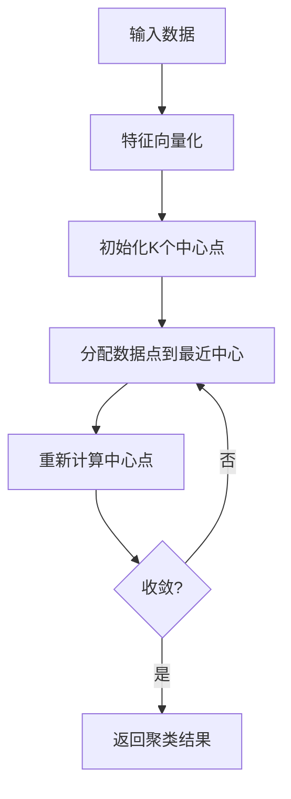

**功能描述**: 使用Spark MLlib的K-means算法对数据进行聚类分析

**请求格式**:
```json
{
  "features": [
    {"feature1": 1.0, "feature2": 2.0},
    {"feature1": 1.5, "feature2": 1.8},
    {"feature1": 5.0, "feature2": 8.0},
    {"feature1": 8.0, "feature2": 8.0},
    {"feature1": 1.0, "feature2": 0.6}
  ],
  "k": 3,
  "maxIterations": 20
}
```

**响应格式**:
```json
{
  "predictions": [
    {"feature1": 1.0, "feature2": 2.0, "cluster": 0},
    {"feature1": 1.5, "feature2": 1.8, "cluster": 0},
    {"feature1": 5.0, "feature2": 8.0, "cluster": 1},
    {"feature1": 8.0, "feature2": 8.0, "cluster": 1},
    {"feature1": 1.0, "feature2": 0.6, "cluster": 0}
  ],
  "centers": [
    {"feature1": 1.16, "feature2": 1.46},
    {"feature1": 6.5, "feature2": 8.0}
  ],
  "cost": 0.5
}
```

**实现原理**:
- 将输入数据转换为DataFrame
- 使用VectorAssembler将特征列合并为向量
- 创建KMeans实例并设置参数
- 训练KMeans模型
- 使用模型进行预测
- 获取聚类中心和代价函数值
- 转换结果并返回

**核心代码**:
```java
public Map<String, Object> performKMeansClustering(Dataset<Row> data) {
    try {
        logger.info("开始K-means聚类分析，数据集schema: {}", data.schema().treeString());
        
        if (data == null || data.isEmpty()) {
            throw new IllegalArgumentException("输入数据集不能为空");
        }
        
        // 创建特征向量
        VectorAssembler assembler = new VectorAssembler()
            .setInputCols(new String[]{"feature1", "feature2"})
            .setOutputCol("features");
            
        Dataset<Row> vectorData = assembler.transform(data);
        
        // 训练K-means模型
        KMeans kmeans = new KMeans()
            .setK(3)  // 设置聚类数为3
            .setSeed(1L)
            .setMaxIter(20)  // 设置最大迭代次数
            .setTol(1e-4);   // 设置收敛容差
            
        KMeansModel model = kmeans.fit(vectorData);
        
        // 预测聚类结果
        Dataset<Row> predictions = model.transform(vectorData);
        
        // 计算每个簇的中心点
        Vector[] centers = model.clusterCenters();
        
        // 收集结果
        Map<String, Object> result = new HashMap<>();
        
        // 将预测结果转换为可序列化的格式
        List<Map<String, Object>> predictionsList = new ArrayList<>();
        for (Row row : predictions.select("feature1", "feature2", "prediction").collectAsList()) {
            Map<String, Object> predictionMap = new HashMap<>();
            predictionMap.put("feature1", row.getDouble(0));
            predictionMap.put("feature2", row.getDouble(1));
            predictionMap.put("cluster", row.getInt(2));
            predictionsList.add(predictionMap);
        }
        result.put("predictions", predictionsList);
        
        // 将中心点转换为可序列化的格式
        List<Map<String, Double>> centersList = new ArrayList<>();
        for (Vector center : centers) {
            Map<String, Double> centerMap = new HashMap<>();
            centerMap.put("feature1", center.apply(0));
            centerMap.put("feature2", center.apply(1));
            centersList.add(centerMap);
        }
        result.put("centers", centersList);
        
        // 计算模型评估指标
        double cost = model.summary().trainingCost();
        result.put("cost", cost);
        
        return result;
    } catch (Exception e) {
        logger.error("K-means聚类分析过程中发生错误", e);
        throw new RuntimeException("K-means聚类分析失败: " + e.getMessage(), e);
    }
}
```

**Spark知识点**:
- `Spark MLlib`: Spark的机器学习库
- `VectorAssembler`: 特征工程工具，将多个列合并为特征向量
- `KMeans`: 无监督学习算法，用于聚类分析
- `KMeansModel`: 训练好的K-means模型
- `clusterCenters`: 获取聚类中心
- `trainingCost`: 代价函数值，用于评估模型质量

#### 2.2 用户行为聚类分析 API

**接口路径**: `POST /api/advanced/user-clustering`

**功能描述**: 基于用户行为数据进行聚类分析，识别不同的用户群体

**请求格式**:
```json
{
  "users": [
    {"userId": 1, "monthlySpending": 2000, "purchaseFrequency": 5},
    {"userId": 2, "monthlySpending": 500, "purchaseFrequency": 2},
    {"userId": 3, "monthlySpending": 5000, "purchaseFrequency": 10},
    {"userId": 4, "monthlySpending": 100, "purchaseFrequency": 1},
    {"userId": 5, "monthlySpending": 3000, "purchaseFrequency": 8}
  ]
}
```

**响应格式**:
```json
{
  "predictions": [
    {"userId": 1, "monthlySpending": 2000, "purchaseFrequency": 5, "cluster": 1},
    {"userId": 2, "monthlySpending": 500, "purchaseFrequency": 2, "cluster": 0},
    {"userId": 3, "monthlySpending": 5000, "purchaseFrequency": 10, "cluster": 2},
    {"userId": 4, "monthlySpending": 100, "purchaseFrequency": 1, "cluster": 0},
    {"userId": 5, "monthlySpending": 3000, "purchaseFrequency": 8, "cluster": 2}
  ],
  "centers": [
    {"monthlySpending": 300, "purchaseFrequency": 1.5},
    {"monthlySpending": 2000, "purchaseFrequency": 5},
    {"monthlySpending": 4000, "purchaseFrequency": 9}
  ],
  "clusterDescriptions": [
    "用户群体0: 低消费低频率用户",
    "用户群体1: 中等消费中频率用户",
    "用户群体2: 高消费高频率用户"
  ]
}
```

**实现原理**:
- 将用户数据转换为DataFrame
- 使用VectorAssembler创建特征向量
- 设置KMeans参数并训练模型
- 预测用户所属簇
- 获取聚类中心
- 生成用户群体描述
- 返回分析结果

**核心代码**:
```java
public Map<String, Object> performUserBehaviorClustering(Dataset<Row> data) {
    try {
        // 创建特征向量
        VectorAssembler assembler = new VectorAssembler()
            .setInputCols(new String[]{"monthlySpending", "purchaseFrequency"})
            .setOutputCol("features");
            
        Dataset<Row> vectorData = assembler.transform(data);
        
        // 训练K-means模型
        KMeans kmeans = new KMeans()
            .setK(4)  // 设置聚类数为4，将用户分为4个群体
            .setSeed(1L)
            .setMaxIter(20)  // 设置最大迭代次数
            .setTol(1e-4);   // 设置收敛容差
            
        KMeansModel model = kmeans.fit(vectorData);
        
        // 预测聚类结果
        Dataset<Row> predictions = model.transform(vectorData);
        
        // 计算每个簇的中心点
        Vector[] centers = model.clusterCenters();
        
        // 收集结果
        Map<String, Object> result = new HashMap<>();
        
        // 将预测结果转换为可序列化的格式
        List<Map<String, Object>> predictionsList = new ArrayList<>();
        for (Row row : predictions.select("monthlySpending", "purchaseFrequency", "prediction").collectAsList()) {
            Map<String, Object> predictionMap = new HashMap<>();
            predictionMap.put("monthlySpending", row.getDouble(0));
            predictionMap.put("purchaseFrequency", row.getDouble(1));
            predictionMap.put("cluster", row.getInt(2));
            predictionsList.add(predictionMap);
        }
        result.put("predictions", predictionsList);
        
        // 将中心点转换为可序列化的格式
        List<Map<String, Double>> centersList = new ArrayList<>();
        for (Vector center : centers) {
            Map<String, Double> centerMap = new HashMap<>();
            centerMap.put("monthlySpending", center.apply(0));
            centerMap.put("purchaseFrequency", center.apply(1));
            centersList.add(centerMap);
        }
        result.put("centers", centersList);
        
        // 添加用户群体描述
        List<String> clusterDescriptions = new ArrayList<>();
        for (int i = 0; i < centersList.size(); i++) {
            Map<String, Double> center = centersList.get(i);
            String description = generateClusterDescription(i, center);
            clusterDescriptions.add(description);
        }
        result.put("clusterDescriptions", clusterDescriptions);
        
        return result;
    } catch (Exception e) {
        logger.error("用户行为聚类分析过程中发生错误", e);
        throw new RuntimeException("用户行为聚类分析失败: " + e.getMessage(), e);
    }
}
```

**Spark知识点**:
- `DataFrame`: Spark的带有Schema的分布式数据结构
- `SparkML Pipeline`: 构建机器学习工作流的API
- `VectorAssembler`: 将多列合并为特征向量的转换器 
- `KMeans`: 经典的无监督学习聚类算法
- `transform`: 应用学习模型进行预测

#### 2.3 实时流处理 API

**Spark Streaming流程图**:

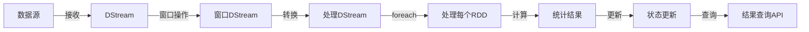

**功能描述**: 启动Spark Streaming流处理任务，实时分析交易数据

**请求格式**:
```json
{
  "timeWindowSeconds": 60,
  "anomalyThreshold": 1000
}
```

**响应格式**:
```json
{
  "status": "success",
  "message": "流处理任务已启动",
  "timeWindow": 60,
  "anomalyThreshold": 1000
}
```

**实现原理**:
- 创建JavaStreamingContext
- 设置时间窗口和异常检测阈值
- 创建自定义数据接收器
- 应用窗口操作处理流数据
- 计算各种统计指标
- 检测异常交易
- 更新统计信息

**核心代码**:
```java
public void startStreaming(int timeWindowSeconds, double threshold) {
    logger.info("开始启动流处理，时间窗口：{}秒，异常阈值：{}", timeWindowSeconds, threshold);
    
    if (isStreaming.get()) {
        logger.info("流处理已经在运行中，不需要重新启动");
        return;
    }

    this.timeWindow = timeWindowSeconds;
    this.anomalyThreshold = threshold;

    try {
        // 检查SparkContext是否可用
        if (javaSparkContext == null || javaSparkContext.sc().isStopped()) {
            logger.error("JavaSparkContext不可用或已停止，无法启动流处理");
            throw new IllegalStateException("JavaSparkContext不可用或已停止");
        }
        
        // 每次启动时创建新的JavaStreamingContext
        streamingContext = new JavaStreamingContext(javaSparkContext, new Duration(1000));
        logger.info("新的JavaStreamingContext创建成功");

        // 创建模拟数据流
        SimulatedTransactionReceiver receiver = new SimulatedTransactionReceiver();
        JavaDStream<Transaction> stream = streamingContext.receiverStream(receiver);
        logger.info("模拟数据流创建成功");

        // 处理数据流
        processStream(stream);

        // 启动流处理
        streamingContext.start();
        isStreaming.set(true);
        logger.info("流处理启动成功");
        
        // 初始化示例数据
        initializeExampleData();
    } catch (Exception e) {
        // 处理异常...
    }
}

private void processStream(JavaDStream<Transaction> stream) {
    try {
        // 计算滑动窗口统计
        JavaDStream<Transaction> windowedTransactions = stream.window(
            new Duration(timeWindow * 1000),
            new Duration(1000)
        );

        // 计算实时统计指标
        windowedTransactions.foreachRDD(rdd -> {
            try {
                if (!rdd.isEmpty()) {
                    // 计算基本统计量
                    List<Transaction> transactionsList = rdd.collect();
                    
                    double totalAmount = transactionsList.stream()
                        .mapToDouble(Transaction::getAmount)
                        .sum();
                    double avgAmount = totalAmount / transactionsList.size();
                    int totalTransactions = transactionsList.size();
                    long uniqueUsers = transactionsList.stream()
                        .map(Transaction::getUserId)
                        .distinct()
                        .count();

                    // 检测异常交易
                    int anomalyCount = (int) transactionsList.stream()
                        .filter(t -> t.getAmount() > anomalyThreshold)
                        .count();
                            
                    // 更新统计信息
                    updateStats(avgAmount, totalTransactions, uniqueUsers, anomalyCount);

                    // 计算趋势数据
                    calculateTrends(transactionsList);
                }
            } catch (Exception e) {
                logger.error("处理RDD时发生错误", e);
            }
        });
    } catch (Exception e) {
        logger.error("设置数据流处理时发生错误", e);
        throw e;
    }
}
```

**获取流处理统计数据 API**:

**接口路径**: `GET /api/advanced/streaming-stats`

**响应格式**:
```json
{
  "avgSpending": 325.75,
  "totalTransactions": 150,
  "totalUsers": 45,
  "anomalyCount": 5,
  "spendingTrend": [310.5, 320.2, 330.1, 325.75, 340.2, 345.6, 335.8, 328.9, 332.4, 325.75],
  "frequencyTrend": [3.2, 3.5, 3.8, 3.6, 3.9, 4.1, 3.8, 3.5, 3.7, 3.6]
}
```

**Spark知识点**:
- `JavaStreamingContext`: Spark Streaming的入口点
- `Receiver`: 自定义数据接收器
- `JavaDStream`: 离散化流，表示连续数据流
- `window`: 滑动窗口操作，对一段时间内的数据进行处理
- `foreachRDD`: 对流中的每个RDD应用操作
- `Duration`: 时间间隔抽象

#### 2.4 用户关系网络分析 API

**GraphX处理流程**:

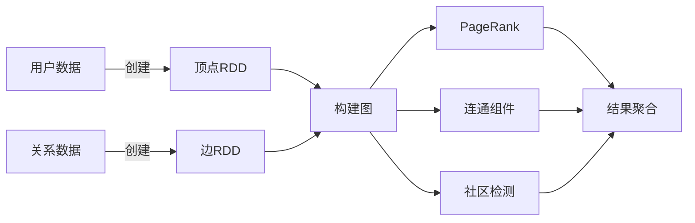

**接口路径**: `GET /api/advanced/user-network`

**功能描述**: 使用Spark GraphX分析用户关系网络

**响应格式**:
```json
{
  "vertexCount": 100,
  "edgeCount": 350,
  "communitiesCount": 5,
  "avgDegree": 7.0,
  "topUsers": [
    {"userId": 23, "pageRank": 5.23, "connections": 15},
    {"userId": 45, "pageRank": 4.56, "connections": 12},
    {"userId": 12, "pageRank": 3.89, "connections": 9}
  ],
  "communityStats": [
    {"communityId": 0, "size": 25, "density": 0.4},
    {"communityId": 1, "size": 30, "density": 0.35},
    {"communityId": 2, "size": 15, "density": 0.6}
  ]
}
```

**实现原理**:
- 创建顶点和边RDD
- 构建Graph对象
- 计算PageRank评分
- 执行图分析算法
- 收集结果并返回

**Spark知识点**:
- `GraphX`: Spark的图计算库
- `Graph`: 图的抽象表示
- `VertexRDD`: 顶点的弹性分布式数据集
- `EdgeRDD`: 边的弹性分布式数据集
- `PageRank`: 衡量图中节点重要性的算法
- `ConnectedComponents`: 查找连通组件的算法

## Spark知识点全面解析

### Spark处理模式比较

```mermaid
graph TD
    subgraph "批处理模式"
    A1[RDD] --> B1[转换操作]
    B1 --> C1[动作操作]
    C1 --> D1[结果]
    end
    
    subgraph "交互式分析"
    A2[SparkSQL] --> B2[DataFrame/Dataset]
    B2 --> C2[SQL查询]
    C2 --> D2[结果]
    end
    
    subgraph "流处理模式"
    A3[输入流] --> B3[DStream]
    B3 --> C3[窗口操作]
    C3 --> D3[状态更新]
    D3 --> E3[输出]
    end
    
    subgraph "机器学习"
    A4[特征] --> B4[训练]
    B4 --> C4[模型]
    C4 --> D4[预测]
    end
    
    subgraph "图计算"
    A5[顶点] --> B5[边]
    B5 --> C5[图构建]
    C5 --> D5[图算法]
    end
```

### 1. Spark核心概念

#### 1.1 RDD (弹性分布式数据集)
- **定义**: Spark的基础数据抽象，表示分布在集群上的不可变、可分区、可并行操作的元素集合
- **特性**: 
  - 不可变性: RDD一旦创建，不能修改
  - 分区: 数据被分割成多个部分并分布在集群各节点
  - 弹性: 可以从部分故障中恢复
  - 惰性求值: 转换操作只有在action被调用时才执行
- **操作类型**:
  - 转换(Transformation): 如map, filter, flatMap, reduceByKey等，返回新RDD
  - 动作(Action): 如count, collect, save等，触发计算并返回结果
- **在项目中的应用**: 词频统计功能中使用RDD API处理文本数据

#### 1.2 DataFrame & Dataset
- **DataFrame**: 组织成命名列的分布式数据集合，概念上等同于关系型数据库中的表
- **Dataset**: 强类型的数据集合，结合了RDD的类型安全和DataFrame的优化执行引擎
- **特点**:
  - 带有Schema信息
  - 优化的执行计划
  - 与Spark SQL无缝集成
  - 支持各种数据源(CSV, JSON, Parquet等)
- **在项目中的应用**: CSV数据分析、聚类分析使用DataFrame

#### 1.3 SparkSession
- **定义**: 从Spark 2.0开始，SparkSession成为Spark应用程序的入口点
- **功能**:
  - 统一了SparkContext、SQLContext和HiveContext的功能
  - 提供了读取和处理各种数据格式的API
  - 支持创建临时视图和执行SQL查询
- **在项目中的应用**: 通过SparkConfig配置类创建并注入SparkSession，用于所有Spark操作

### 2. Spark MLlib

#### 2.1 K-means聚类
- **原理**: 将数据点划分为预定义数量的簇，使得每个点都属于距离最近的簇中心
- **算法步骤**:
  1. 随机初始化K个簇中心
  2. 将每个数据点分配到最近的簇中心
  3. 重新计算每个簇的中心
  4. 重复步骤2和3直到收敛
- **在项目中的应用**: 用户行为聚类分析，将用户按消费模式分组

#### 2.2 向量和特征转换
- **VectorAssembler**: 将多个列合并成一个特征向量
- **特征缩放**: 标准化和归一化特征值
- **在项目中的应用**: K-means聚类前使用VectorAssembler转换用户数据

### 3. Spark Streaming

#### 3.1 DStream (离散化流)
- **定义**: 表示连续数据流的抽象，内部由一系列连续的RDD组成
- **操作**: 支持类似RDD的转换操作，如map, filter, reduce等
- **窗口操作**: 允许在滑动窗口上计算结果
- **在项目中的应用**: 实时分析交易数据流，计算统计指标

#### 3.2 接收器和输入源
- **自定义接收器**: 实现Receiver接口来接收自定义数据源
- **内置源**: Kafka, Flume, HDFS等
- **在项目中的应用**: 使用SimulatedTransactionReceiver生成模拟交易数据

### 4. Spark GraphX

#### 4.1 图的表示
- **顶点RDD**: 包含(ID, 属性)对的RDD
- **边RDD**: 包含(源ID, 目标ID, 属性)对的RDD
- **Graph对象**: 由顶点RDD和边RDD组成的图
- **在项目中的应用**: 建模用户关系网络

#### 4.2 图算法
- **PageRank**: 评估顶点在图中的重要性
- **连通组件**: 查找图中的连通子图
- **社区检测**: 识别图中的紧密连接群体
- **在项目中的应用**: 分析用户网络中的影响力和社区结构

## 数据处理生命周期

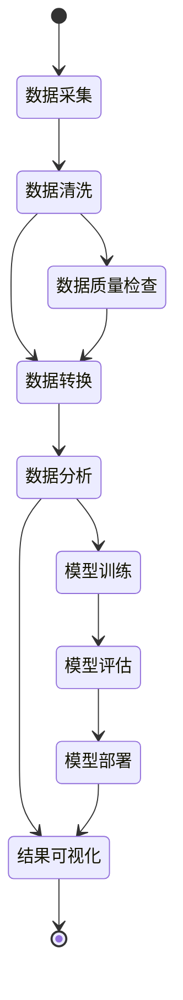

## 项目组件关系图

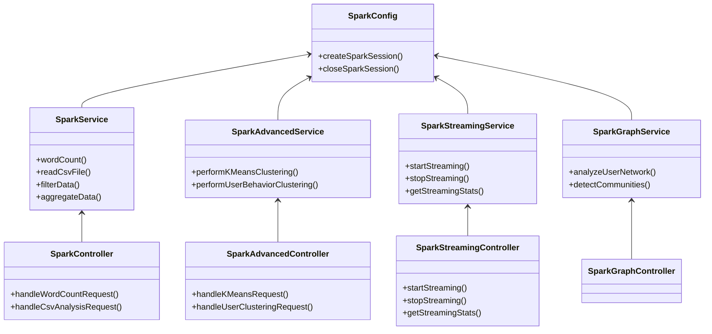

## 运行和部署指南

### 1. 环境要求

- Java JDK 8+
- Apache Maven 3.6+
- Apache Spark 3.3.0 (可作为依赖项引入)
- Node.js 16+ (前端开发)

### 2. 本地运行

1. 克隆仓库:
```bash
git clone https://github.com/example/spark-springboot-demo.git
cd spark-springboot-demo
```

2. 编译后端:
```bash
mvn clean package
```

3. 运行应用:
```bash
java -jar target/spark-springboot-demo-0.0.1-SNAPSHOT.jar
```

4. 启动前端开发服务器:
```bash
cd frontend/spark-demo-ui
npm install
npm start
```

### 3. 生产环境部署

1. 构建优化的JAR包:
```bash
mvn clean package -Pprod
```

2. 构建前端:
```bash
cd frontend/spark-demo-ui
npm run build
```

3. 使用start.sh脚本运行应用:
```bash
./start.sh
```

## 高级功能使用流程

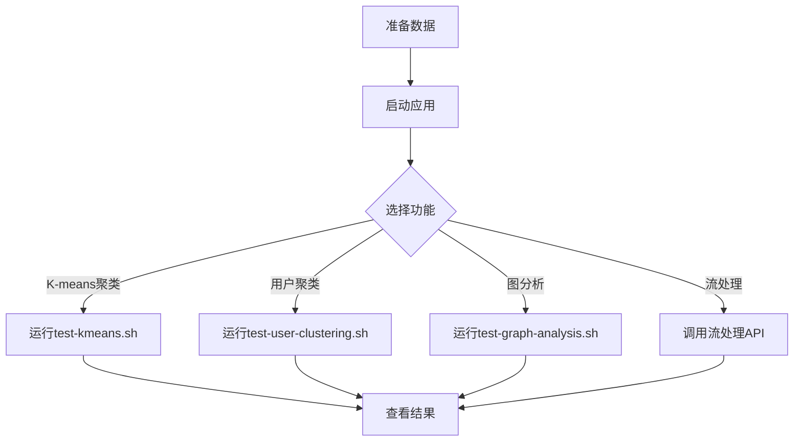

