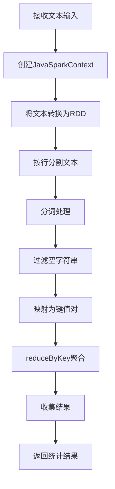
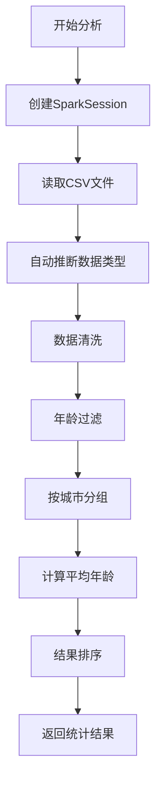
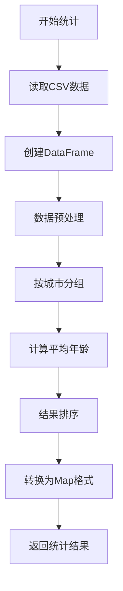
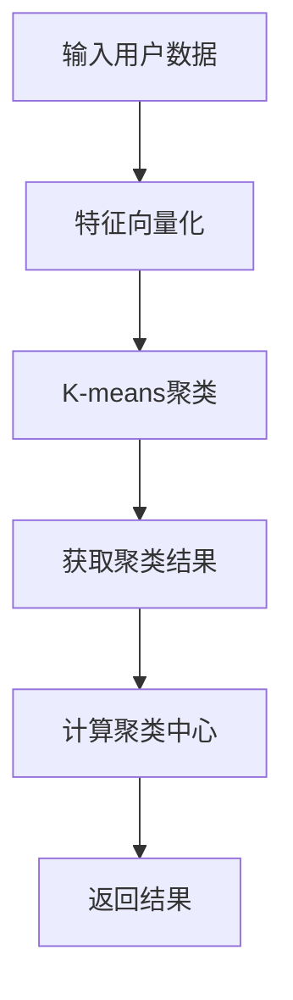
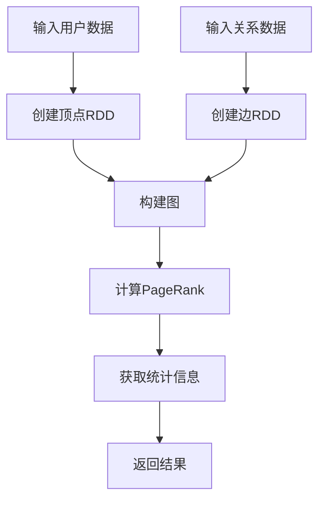
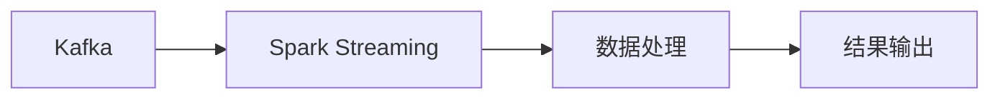

# Spring Boot 集成 Spark 示例项目

这是一个演示如何在Spring Boot应用程序中集成Apache Spark的示例项目。

## 功能特点

- Spring Boot与Apache Spark集成
- 使用JavaSparkContext和SparkSession进行Spark操作
- 实现RDD基本操作（词频统计）
- 实现Spark SQL操作（读取CSV、过滤数据、聚合数据）
- RESTful API接口

## 项目结构

```
spark-springboot-demo
├── src/main/java/com/example/sparkdemo
│   ├── SparkDemoApplication.java    # 应用程序入口
│   ├── config
│   │   └── SparkConfig.java         # Spark配置类
│   ├── controller
│   │   └── SparkDemoController.java # REST控制器
│   └── service
│       └── SparkService.java        # Spark服务实现
├── src/main/resources
│   ├── application.properties       # 应用配置
│   └── data
│       └── sample.csv               # 示例数据
└── pom.xml                          # Maven依赖
```

## 如何运行

1. 确保安装了Java 8以上版本和Maven
2. 克隆本项目到本地
3. 运行以下命令启动应用程序：

```bash
mvn spring-boot:run
```

4. 应用将在 http://localhost:8088 运行

## API接口说明

### 1. 词频统计接口

**接口地址**: `POST /api/spark/wordcount`

**功能说明**: 对输入的文本进行词频统计，使用Spark RDD实现

**请求格式**:
```
Content-Type: text/plain

这是一个示例文本
用于测试Spark单词计数
```

**响应格式**:
```json
{
    "result": {
        "这是": 1,
        "一个": 1,
        "示例": 1,
        "文本": 1,
        "用于": 1,
        "测试": 1,
        "Spark": 1,
        "单词": 1,
        "计数": 1
    },
    "totalWords": 9,
    "uniqueWords": 9
}
```

**内部实现逻辑**:
1. 使用`JavaSparkContext`将输入文本转换为RDD
2. 按行分割文本
3. 对每行文本进行分词
4. 过滤空字符串
5. 将每个单词映射为(word, 1)的键值对
6. 使用reduceByKey进行词频统计
7. 将结果收集为Map返回

**词频统计流程图**:


### 2. CSV数据分析接口

**接口地址**: `GET /api/spark/analyze-csv`

**功能说明**: 读取CSV文件并进行数据分析，包括数据过滤和聚合

**响应格式**:
```json
{
    "status": "success",
    "totalRecords": 100,
    "filteredRecords": 45
}
```

**内部实现逻辑**:
1. 使用SparkSession读取CSV文件
2. 自动推断数据类型
3. 过滤年龄大于30的记录
4. 按城市分组计算平均年龄
5. 返回统计结果

**CSV分析流程图**:


### 3. 城市年龄统计接口

**接口地址**: `GET /api/spark/city-age-stats`

**功能说明**: 获取各城市的平均年龄统计信息

**响应格式**:
```json
{
    "status": "success",
    "data": {
        "北京": 32.5,
        "上海": 35.2,
        "广州": 28.8
    },
    "totalCities": 3
}
```

**内部实现逻辑**:
1. 读取CSV文件数据
2. 使用Spark SQL进行数据聚合
3. 按城市分组计算平均年龄
4. 将结果转换为Map格式返回

**城市年龄统计流程图**:


## 高级功能

### 1. K-means聚类分析

使用Spark ML库进行用户聚类分析，基于用户的年龄和收入特征。



API端点：`POST /api/advanced/kmeans`
请求体：用户数据集（包含age和income字段）
响应：聚类结果、聚类中心和代价函数值

### 2. 用户关系网络分析

使用Spark GraphX进行用户关系网络分析，计算用户重要性（PageRank）。



API端点：`POST /api/advanced/network`
请求体：
- 用户数据集（包含id和name字段）
- 关系数据集（包含sourceId、targetId和relationship字段）
响应：图结构、PageRank值、顶点数和边数

### 3. 实时流处理

使用Spark Streaming处理Kafka实时数据流。



API端点：`POST /api/advanced/stream/start`
功能：启动实时流处理，从Kafka主题"user_actions"读取数据

## 运行高级功能

1. 确保Kafka和ZooKeeper已启动：
```bash
# 启动ZooKeeper
bin/zookeeper-server-start.sh config/zookeeper.properties

# 启动Kafka
bin/kafka-server-start.sh config/server.properties
```

2. 创建Kafka主题：
```bash
bin/kafka-topics.sh --create --topic user_actions --bootstrap-server localhost:9092 --replication-factor 1 --partitions 1
```

3. 启动应用程序：
```bash
mvn spring-boot:run
```

4. 测试API：
```bash
# K-means聚类
curl -X POST http://localhost:8080/api/advanced/kmeans -H "Content-Type: application/json" -d @user_data.json

# 网络分析
curl -X POST http://localhost:8080/api/advanced/network -H "Content-Type: application/json" -d @network_data.json

# 启动流处理
curl -X POST http://localhost:8080/api/advanced/stream/start
```

## 性能优化建议

1. 数据预处理
   - 对输入数据进行清洗和标准化
   - 使用缓存机制减少重复计算

2. 集群配置
   - 根据数据规模调整Spark配置
   - 合理设置分区数
   - 使用广播变量优化join操作

3. 监控和调优
   - 使用Spark UI监控作业执行
   - 分析性能瓶颈
   - 优化数据倾斜问题

## 注意事项

1. 内存管理
   - 监控Spark执行器内存使用情况
   - 适当调整内存配置参数

2. 错误处理
   - 实现完善的异常处理机制
   - 记录详细的错误日志

3. 数据安全
   - 确保敏感数据的安全处理
   - 实现适当的访问控制机制

## 测试说明

### 单元测试
```bash
mvn test
```

### 集成测试
```bash
mvn verify
```

### 性能测试
```bash
mvn jmeter:jmeter
```

## 部署说明

1. 环境要求
   - Java 8+
   - Maven 3.6+
   - Spark 3.3.2
   - Kafka 2.8.1
   - ZooKeeper 3.7.0

2. 配置说明
   - 修改`application.properties`中的配置
   - 配置Kafka连接信息
   - 设置Spark参数

3. 启动步骤
   ```bash
   # 启动ZooKeeper
   bin/zkServer.sh start

   # 启动Kafka
   bin/kafka-server-start.sh config/server.properties

   # 启动应用
   mvn spring-boot:run
   ```

## 脚本使用说明

### 1. 启动应用

使用以下命令启动Spring Boot应用程序：

```bash
./start.sh
```

该脚本会检查Java是否已安装，然后使用Maven wrapper启动应用程序。

### 2. 测试K-means聚类接口

应用启动后，可以使用以下命令测试K-means聚类API：

```bash
./test-kmeans.sh
```

该脚本会向`/api/advanced/kmeans`接口发送POST请求，包含10个样本点的测试数据，并显示聚类结果。

#### K-means API说明

- **URL**: `http://localhost:8080/api/advanced/kmeans`
- **方法**: POST
- **内容类型**: application/json
- **请求体格式**: 
  ```json
  [
    {"feature1": 数值1, "feature2": 数值2},
    {"feature1": 数值1, "feature2": 数值2},
    ...
  ]
  ```
- **响应**: 包含聚类预测结果和聚类中心点

#### 手动测试命令

```bash
curl -X POST \
  -H "Content-Type: application/json" \
  -d '[{"feature1": 1.0, "feature2": 1.0}, {"feature1": 5.0, "feature2": 7.0}]' \
  http://localhost:8080/api/advanced/kmeans
``` 